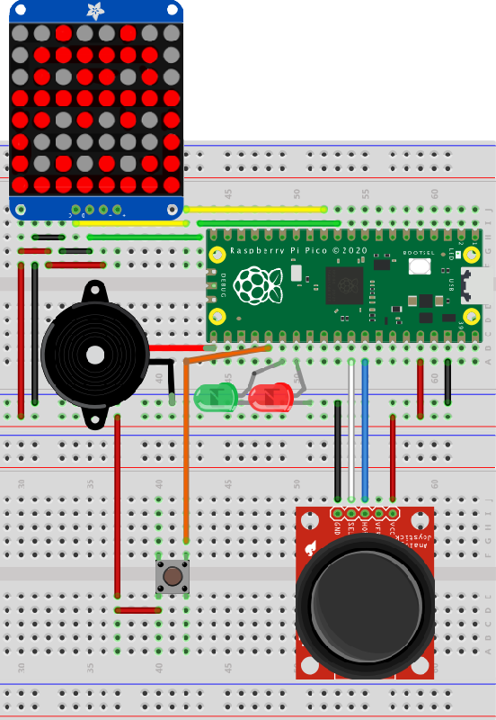

# pi-pico-go

Go experiments for the [Raspberry Pi RP2040 MCU](https://www.raspberrypi.com/documentation/microcontrollers/rp2040.html#documentation) using [TinyGo](https://tinygo.org/). This repo includes:

See [the full write-up of using the RP2040 and Go on macOS](https://blog.smittytone.net/2023/08/19/go-program-the-raspberry-pi-pico-with-go/).

## Projects

* [Hunt the Wumpus](#hunt-the-wumpus)

## Installation

* [Install Go](https://go.dev)
* [Install TinyGo](https://tinygo.org/getting-started/install/)
* Clone the repo.
* Switch to a project directory, eg. `cd path/to/repo/wumpus`.
* Run `go mod tidy` to get dependencies.
* Connect your Raspberry Pi Pico.
* Run `tinygo flash -target pico` to build and install the application.

### Hunt the Wumpus

A sample project to build a fun game.

#### Requirements

* An HT16K33-based 8x8 LED matrix; [I used this display](https://www.adafruit.com/product/1049).
* A piezo speaker.
* One small button.
* A two-way, self-centring analog joystick; [there are lots available on eBay](https://www.ebay.co.uk/itm/New-PSP-2-Axis-Analog-Thumb-GAME-Joystick-Module-3V-5V-For-arduino-PSP/401104248437?hash=item5d63ad1e75:g:HcEAAOSwjqVZNSzw).
* A red LED.
* A green LED.
* Wires.
* Two standard breadboards.

#### The circuit

* Make sure you wire the LEDs correctly: longer leg to the Pico pin, shorter leg to GND.
* The joystick shown is not the one used, but it gives you the idea. Connect white to the X pin, blue to the Y pin.

#### The Game

This is a fun little game to hunt the Wumpus. Move through the cave with the joystick.

A red light indicates a nearby pit — if you fall in, you’ll be killed.

A twittering sound indicates a nearby bat. If you enter its square, it will carry you to another part of the cave.

A green light indicates the Wumpus is close. Enter its square and it will eat you, but if you’re sure where it is, press the button to fire an arrow to kill it first. To fire the arrow successfully, back off and then move toward the Wumpus in the direction you want to the arrow to fly. If you miss, the beast will catch you!

#### Credits

This version was based on a C port of an [Arduino version created by Corey Faure](https://github.com/coreyfaure/HuntTheWumpus-Arduino). This is very much his game, but I have taken a few liberties with a couple of the animations and rewritten the code.

All source code released under the MIT Licence. Copyright © 2023, Tony Smith (@smittytone).
